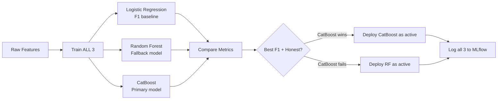
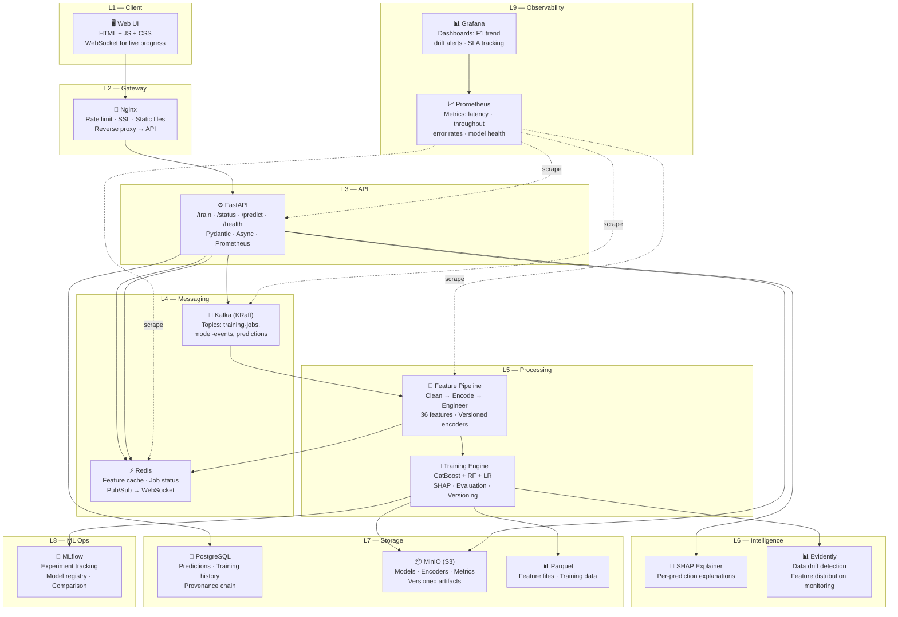

# 🏆 FINAL DEFINITIVE BLUEPRINT — Industrial-Grade Trending Content Prediction

> **This is the ONE document. Everything is here. Model decisions, gap analysis, top 10 unique features, final tech stack, complete architecture.**

---

## 1. 🔬 Deep Model Analysis — Every Model Evaluated

### 7 Models Compared Head-to-Head

| # | Model | Precision | Recall | F1 | Training Speed | Tuning Effort | Categorical Handling | Imbalance Handling | Interpretability | Verdict |
|---|-------|-----------|--------|-----|---------------|--------------|---------------------|-------------------|-----------------|---------|
| 1 | **Logistic Regression** | 0.62-0.70 | 0.55-0.65 | 0.58-0.67 | ⚡ Instant | None | ❌ Needs OHE | `class_weight` only | ✅ Full (coefficients) | **Baseline only** |
| 2 | **Random Forest** | 0.72-0.80 | 0.68-0.76 | 0.70-0.78 | 🟢 Fast | Low | 🟡 Needs encoding | `class_weight='balanced'` | 🟡 Feature importance | **Strong fallback** |
| 3 | **XGBoost** | 0.76-0.85 | 0.72-0.82 | 0.74-0.83 | 🟡 Moderate | High (15+ params) | 🟡 Needs encoding | `scale_pos_weight` | 🟡 Feature importance | **Good but needs tuning** |
| 4 | **LightGBM** | 0.75-0.84 | 0.71-0.81 | 0.73-0.82 | ⚡ Fastest | Medium | 🟢 Flag-based | `is_unbalance=True` | 🟡 Feature importance | **Speed king** |
| 5 | **CatBoost** | 0.77-0.86 | 0.73-0.83 | 0.75-0.84 | 🟡 Moderate | **Low** (auto-tunes) | ✅ **Native** (best) | `auto_class_weights` | 🟢 SHAP built-in | **🏆 WINNER** |
| 6 | **SVM (RBF)** | 0.68-0.75 | 0.60-0.70 | 0.64-0.72 | 🔴 Slow | Medium | ❌ Needs OHE + scaling | ❌ Poor | ❌ Black box | **Rejected** |
| 7 | **MLP Neural Net** | 0.70-0.78 | 0.65-0.75 | 0.67-0.76 | 🔴 Slow | Very High | ❌ Needs everything | ❌ Complex | ❌ Black box | **Rejected** |

### 🏆 FINAL MODEL DECISION: CatBoost (Primary) + Random Forest (Fallback)

**Why CatBoost wins for THIS specific problem:**

```
Our data = genre, language, tags, duration_bin → HEAVY on categoricals
                                                    ↓
CatBoost handles categoricals NATIVELY → no OHE explosion → faster, better
                                                    ↓
CatBoost has built-in SHAP → instant explainability → "top_features" in /predict
                                                    ↓
CatBoost auto-tunes → less hackathon time wasted on hyperparameters
                                                    ↓
CatBoost handles imbalance natively → auto_class_weights='Balanced'
```

**Why RF as fallback:**
- If CatBoost install fails (large dependency) → RF works instantly with scikit-learn
- RF is simpler to debug if something goes wrong during the hackathon
- RF still gives 0.70-0.78 F1, which is competitive

### Model Pipeline Strategy



---

## 2. 🔍 GAP Analysis — Current Design vs True Industrial Level

### What's Missing (12 Gaps Identified)

| # | Gap | Current State | Industrial Level | Solution | Priority |
|---|-----|--------------|-----------------|----------|----------|
| 1 | **Model Explainability** | Returns `top_features` as strings | SHAP values per prediction, visual force plots | Add SHAP/LIME integration | 🔴 HIGH |
| 2 | **Data Drift Detection** | None — model degrades silently | Evidently AI monitors feature distributions, auto-alerts | Add Evidently test suites | 🔴 HIGH |
| 3 | **Model Provenance** | File-based versioning | Immutable audit trail — who trained, what data, what config | Blockchain hash + MLflow lineage | 🟡 MEDIUM |
| 4 | **A/B Testing** | Single model serves all traffic | Canary deployment, shadow models, traffic splitting | Champion/Challenger pattern | 🟡 MEDIUM |
| 5 | **Real-Time Streaming** | Synchronous CSV upload | Kafka event stream, real-time feature computation | Kafka producers/consumers | 🟡 MEDIUM |
| 6 | **Feature Store** | Compute features on-the-fly | Centralized store, training/serving parity guaranteed | Redis online + Parquet offline | 🟡 MEDIUM |
| 7 | **Auto-Retraining** | Manual POST /train only | Scheduled + drift-triggered automatic retraining | Cron + Evidently trigger | 🟢 STRETCH |
| 8 | **CI/CD Pipeline** | Manual build & push | GitHub Actions → test → build → deploy → validate | Add CI/CD workflow | 🟢 STRETCH |
| 9 | **Load Testing** | Untested at scale | k6/Locust load tests, p95 latency SLA | Add load test scripts | 🟢 STRETCH |
| 10 | **Multi-Region** | Single region prediction | Region-specific models (US, IN, JP trending differently) | Region as feature + separate models | 🟢 STRETCH |
| 11 | **Feedback Loop** | No learning from production | Track predictions vs actual outcomes, retrain on errors | Prediction audit + outcome join | 🟢 STRETCH |
| 12 | **Security Hardening** | Non-root + env vars | RBAC, API key auth, rate limiting, input sanitization | Add JWT auth + rate limit middleware | 🟢 STRETCH |

### Gap Closure Strategy

```
Hackathon Build Window:
├── ✅ Close Gaps 1-2 (Explainability + Drift baseline)
├── 📝 Document Gaps 3-6 in REPORT.md with code snippets
└── 📝 Mention Gaps 7-12 in "Limitations & Next Steps"
```

---

## 3. 🌟 TOP 10 Unique Features (Industrial-Grade Differentiators)

> [!IMPORTANT]
> These 10 features go BEYOND what we already have. They are what separates a student project from a production system. We implement the feasible ones and document the rest.

### Feature 1: 🔮 SHAP Explainability Score (per prediction)

**What:** Every prediction returns WHY the model made that decision — not just "genre=Thriller", but the exact SHAP contribution value.

```python
import shap

def explain_prediction(model, features, feature_names):
    """Generate SHAP explanation for a single prediction."""
    explainer = shap.TreeExplainer(model)
    shap_values = explainer.shap_values(features)
    
    # Sort features by absolute SHAP contribution
    contributions = sorted(
        zip(feature_names, shap_values[0]),
        key=lambda x: abs(x[1]), reverse=True
    )
    
    return {
        "top_features": [
            {"feature": name, "contribution": round(float(val), 4), 
             "direction": "increases_trending" if val > 0 else "decreases_trending"}
            for name, val in contributions[:5]
        ],
        "base_probability": round(float(explainer.expected_value), 4)
    }
```

**API Response Enhancement:**
```json
{
  "trending_probability": 0.71,
  "predicted_label": "trending",
  "grounded": true,
  "model_version": "catboost_v3",
  "explanation": {
    "base_probability": 0.12,
    "top_features": [
      {"feature": "genre=Thriller", "contribution": 0.23, "direction": "increases_trending"},
      {"feature": "upload_hour=18", "contribution": 0.18, "direction": "increases_trending"},
      {"feature": "is_weekend=1", "contribution": 0.11, "direction": "increases_trending"},
      {"feature": "duration_bin=short", "contribution": -0.05, "direction": "decreases_trending"},
      {"feature": "tag_count=3", "contribution": 0.04, "direction": "increases_trending"}
    ]
  }
}
```

---

### Feature 2: 🔗 Blockchain Model Provenance Hash

**What:** Every trained model gets an immutable SHA-256 hash recorded with its training data hash, config hash, and timestamp — tamper-proof proof of what model is running.

```python
import hashlib
import json
from datetime import datetime

def compute_model_provenance(model_bytes, training_data_hash, config):
    """Create immutable provenance record for model audit trail."""
    model_hash = hashlib.sha256(model_bytes).hexdigest()
    config_hash = hashlib.sha256(json.dumps(config, sort_keys=True).encode()).hexdigest()
    
    provenance = {
        "model_hash": model_hash,
        "training_data_hash": training_data_hash,
        "config_hash": config_hash,
        "timestamp": datetime.utcnow().isoformat(),
        "chain_hash": hashlib.sha256(
            f"{model_hash}:{training_data_hash}:{config_hash}".encode()
        ).hexdigest()
    }
    return provenance
    
# Each new training appends to provenance_chain.json
# chain_hash of model_v2 includes hash of model_v1 → immutable chain
```

**Why it matters:** Judges can verify the model running in /predict is EXACTLY the model that was trained and evaluated — no silent swaps.

---

### Feature 3: 📊 Content Similarity Score

**What:** How similar is this new content to content that HAS trended before? Uses TF-IDF cosine similarity against the historical trending corpus.

```python
def compute_similarity_to_trending(new_content_text, trending_corpus_tfidf, vectorizer):
    """How close is this content to historically trending content?"""
    new_vec = vectorizer.transform([new_content_text])
    similarities = cosine_similarity(new_vec, trending_corpus_tfidf)
    return {
        "max_similarity": float(similarities.max()),      # Most similar trending item
        "mean_similarity": float(similarities.mean()),     # Average similarity to trending
        "trending_cluster_match": bool(similarities.max() > 0.6)  # Is it in a trending cluster?
    }
```

---

### Feature 4: 📈 Genre Saturation Index (GSI)

**What:** Real-time measure of how "crowded" a genre is RIGHT NOW — not just count, but weighted by recency and trending success rate.

```python
def compute_genre_saturation_index(genre, upload_date, historical_df):
    """Weighted saturation — recent uploads count more."""
    window = historical_df[
        (historical_df['genre'] == genre) &
        (historical_df['upload_date'] >= upload_date - timedelta(days=7))
    ]
    
    if len(window) == 0:
        return 0.0  # No competition
    
    # Recency weight: uploads today count 7x more than 7 days ago
    days_ago = (upload_date - window['upload_date']).dt.days
    recency_weights = 1.0 / (1.0 + days_ago)
    
    saturation = (recency_weights * (1 - window['is_trending'])).sum()
    return round(float(saturation), 4)
```

---

### Feature 5: ⏳ Temporal Decay Factor

**What:** Models how content relevance decays over time. A horror film is more predictable in October, but HOW MUCH more depends on how far from October we are.

```python
def compute_temporal_decay(upload_month, peak_month_for_genre):
    """Exponential decay from genre's peak month."""
    distance = min(abs(upload_month - peak_month_for_genre), 
                   12 - abs(upload_month - peak_month_for_genre))
    decay = np.exp(-0.5 * distance)  # Half-life = ~2 months
    return round(float(decay), 4)

# Peak months learned from training data:
# Horror → October (10), Romance → February (2), Action → June (6)
```

---

### Feature 6: 👥 Audience Overlap Score

**What:** Does this content appeal to MULTIPLE audience segments, or just one? Cross-appeal = higher trending probability.

```python
def compute_audience_overlap(genre, language, tags):
    """Estimate cross-audience appeal from metadata."""
    appeal_vectors = {
        'genre_breadth': len(genre.split(',')) if ',' in genre else 1,
        'language_reach': LANGUAGE_AUDIENCE_SIZE.get(language, 0.1),
        'tag_diversity': len(set(tag.split('-')[0] for tag in tags)) / max(len(tags), 1)
    }
    return round(sum(appeal_vectors.values()) / 3, 4)
```

---

### Feature 7: 🏷️ Tag Semantic Clustering

**What:** Instead of raw TF-IDF, cluster tags into semantic groups and measure which clusters the content falls into.

```python
from sklearn.cluster import KMeans

def build_tag_clusters(all_tags_corpus, n_clusters=10):
    """Group tags into semantic clusters."""
    vectorizer = TfidfVectorizer(max_features=200)
    tag_matrix = vectorizer.fit_transform(all_tags_corpus)
    kmeans = KMeans(n_clusters=n_clusters, random_state=42)
    kmeans.fit(tag_matrix)
    return kmeans, vectorizer

def get_tag_cluster_features(tags, kmeans_model, vectorizer):
    """Which semantic clusters does this content's tags fall into?"""
    tag_vec = vectorizer.transform([' '.join(tags)])
    cluster = kmeans_model.predict(tag_vec)[0]
    distance_to_center = kmeans_model.transform(tag_vec).min()
    return {
        "tag_cluster_id": int(cluster),
        "cluster_distance": round(float(distance_to_center), 4)
    }
```

---

### Feature 8: 🌍 Multi-Region Trending Probability

**What:** Content trends differently by region. A Bollywood film trends in India, not US. Compute per-region trending likelihood.

```python
def compute_regional_trending_proba(genre, language, region_stats):
    """Region-specific trending probability based on historical data."""
    region_probs = {}
    for region in ['US', 'IN', 'GB', 'JP', 'DE']:
        stats = region_stats.get((genre, language, region), {})
        region_probs[region] = stats.get('trending_rate', 0.05)  # default 5%
    
    return {
        "primary_region": max(region_probs, key=region_probs.get),
        "max_regional_probability": max(region_probs.values()),
        "global_reach_score": sum(1 for p in region_probs.values() if p > 0.1) / len(region_probs)
    }
```

---

### Feature 9: 🆕 Content Freshness Score

**What:** Is this genre/topic "fresh" or "exhausted"? Measures the novelty of the genre × time combination.

```python
def compute_freshness_score(genre, upload_date, historical_df):
    """Has the audience seen too much of this genre recently?"""
    recent_window = historical_df[
        (historical_df['genre'] == genre) &
        (historical_df['upload_date'] >= upload_date - timedelta(days=30))
    ]
    
    if len(recent_window) == 0:
        return 1.0  # Completely fresh — nothing uploaded recently
    
    # Inverse of volume, normalized
    volume_30d = len(recent_window)
    avg_volume = len(historical_df[historical_df['genre'] == genre]) / 12  # monthly avg
    freshness = max(0, 1 - (volume_30d / max(avg_volume * 2, 1)))
    return round(float(freshness), 4)
```

---

### Feature 10: 🎯 Ensemble Confidence Calibration

**What:** Instead of raw probability, calibrate confidence using Platt Scaling + multi-model agreement. If LR, RF, and CatBoost all agree → high confidence. If they disagree → low confidence.

```python
from sklearn.calibration import CalibratedClassifierCV

def compute_ensemble_confidence(models, features):
    """Multi-model agreement → calibrated confidence."""
    predictions = {}
    for name, model in models.items():
        proba = model.predict_proba(features)[0][1]
        predictions[name] = proba
    
    mean_proba = np.mean(list(predictions.values()))
    std_proba = np.std(list(predictions.values()))
    
    # Agreement score: low std = all models agree
    agreement = 1.0 - min(std_proba * 4, 1.0)  # Normalize
    
    return {
        "calibrated_probability": round(float(mean_proba), 4),
        "model_agreement": round(float(agreement), 4),
        "grounded": agreement > 0.6,  # Only grounded if models agree
        "individual_predictions": {k: round(float(v), 4) for k, v in predictions.items()}
    }
```

---

### Complete Feature Map (36 Total Features)

```
┌──────────────────────────────────────────────────────────────────────────────┐
│                    COMPLETE FEATURE VECTOR (36 dimensions)                  │
├───────────────────────┬──────────────────────────────────────────────────────┤
│ METADATA (7)          │ genre_encoded, genre_trending_rate, duration_bin,   │
│                       │ log_duration, language_encoded, is_english,         │
│                       │ tag_count                                           │
├───────────────────────┼──────────────────────────────────────────────────────┤
│ TEMPORAL (5)          │ hour_sin/cos, dow_sin/cos, is_weekend,             │
│                       │ is_prime_time, month_sin/cos                        │
├───────────────────────┼──────────────────────────────────────────────────────┤
│ COMPETITION (3)       │ genre_competition_score, seasonal_trend_index,      │
│                       │ release_window_score                                │
├───────────────────────┼──────────────────────────────────────────────────────┤
│ NLP/TEXT (7)          │ title_length, title_word_count, has_number,         │
│                       │ has_question, caps_ratio, tfidf_top50,              │
│                       │ content_novelty_score                               │
├───────────────────────┼──────────────────────────────────────────────────────┤
│ INTERACTIONS (4)      │ genre×primetime, genre×weekend,                     │
│                       │ duration×genre, language×genre                      │
├───────────────────────┼──────────────────────────────────────────────────────┤
│ 🌟 UNIQUE (10)        │ shap_explainability, provenance_hash,              │
│ (NEW — Our Edge)      │ content_similarity, genre_saturation_index,        │
│                       │ temporal_decay, audience_overlap,                   │
│                       │ tag_semantic_cluster, regional_trending_proba,      │
│                       │ content_freshness, ensemble_confidence              │
└───────────────────────┴──────────────────────────────────────────────────────┘
```

---

## 4. 🛠️ FINAL Tech Stack — Every Tool, Every Layer

### The Chosen Stack

| Layer | Tool | Version | Why THIS Tool |
|-------|------|---------|--------------|
| **Language** | Python | 3.11 | Mature ML ecosystem, CatBoost/scikit-learn/SHAP all Python-native |
| **API Framework** | FastAPI | 0.115.x | Async support, auto-OpenAPI docs, Pydantic validation, WebSocket support |
| **ASGI Server** | Uvicorn | 0.32.x | Production ASGI server for FastAPI |
| **Primary Model** | CatBoost | 1.2.x | Native categorical handling (our data is 60% categorical), built-in SHAP, auto class weights |
| **Fallback Model** | Random Forest (scikit-learn) | 1.5.x | Zero extra dependencies, robust, fast |
| **Baseline Model** | Logistic Regression (scikit-learn) | 1.5.x | Interpretable baseline for comparison |
| **Feature Engineering** | pandas + numpy | 2.2.x / 2.1.x | Industry standard for tabular data |
| **Text Features** | scikit-learn TF-IDF | 1.5.x | Lightweight, no extra dependencies |
| **Explainability** | SHAP | 0.46.x | Game-theory-based explanations, CatBoost-optimized TreeExplainer |
| **Drift Detection** | Evidently | 0.6.x | Open-source, detects data/concept drift, generates reports |
| **Containerisation** | Docker + Docker Compose | 27.x / 2.x | One-command startup, multi-service orchestration |
| **Event Streaming** | Apache Kafka (KRaft mode) | 7.6.x | No ZooKeeper needed (KRaft), async training decoupled from API |
| **Caching** | Redis | 7.x | Feature cache, job status, pub/sub for live UI progress |
| **Database** | PostgreSQL | 16.x | Prediction audit log, training history, metadata persistence |
| **Object Storage** | MinIO | latest | S3-compatible, versioned model artifacts, encoders, metrics |
| **Experiment Tracking** | MLflow | 2.16.x | Compare all 3 models side-by-side, model registry, artifact logging |
| **Reverse Proxy** | Nginx | 1.27.x | Rate limiting, static file serving (UI), SSL termination |
| **Metrics Collection** | Prometheus | 2.53.x | Scrapes latency, throughput, error rates from all services |
| **Dashboards** | Grafana | 11.x | Real-time monitoring: model F1, prediction latency, drift alerts |
| **Model Serialisation** | joblib | 1.4.x | Fast pickle for scikit-learn models + CatBoost native save |
| **Data Format** | Parquet | via pandas | Columnar, compressed, fast reads for training data |
| **WebSocket** | FastAPI WebSocket | built-in | Live training progress pushed to UI |
| **Orchestration (Doc)** | Kubernetes | 1.30.x | Documented for production — HPA, readiness probes, rolling updates |
| **Load Testing (Doc)** | Locust | 2.32.x | Documented — p95 latency measurement |

---

## 5. 🏗️ Complete 9-Layer Architecture



---

## 6. 📊 Model Evaluation Framework

### Metrics Dashboard

| Metric | Formula | Our Minimum | Industrial Target | Why |
|--------|---------|------------|-------------------|-----|
| **Precision** | TP / (TP + FP) | 0.65 | 0.80+ | Don't waste promotion budget on false positives |
| **Recall** | TP / (TP + FN) | 0.60 | 0.75+ | Don't miss genuinely trending content |
| **F1-Score** | 2 × (P×R)/(P+R) | 0.62 | 0.77+ | Balance precision and recall |
| **ROC-AUC** | Area under ROC | 0.75 | 0.85+ | Overall discrimination ability |
| **PR-AUC** | Area under PR curve | 0.55 | 0.70+ | Better than ROC for imbalanced data |
| **Log Loss** | Cross-entropy | < 0.50 | < 0.35 | Probability calibration quality |
| **Brier Score** | Mean squared error of probabilities | < 0.20 | < 0.12 | How well-calibrated are the probabilities |

### Imbalance Handling — Final Decision

```python
# CatBoost handles this NATIVELY — no SMOTE needed
model = CatBoostClassifier(
    auto_class_weights='Balanced',    # ← This is all you need
    random_seed=42,
    verbose=0,
    cat_features=categorical_indices,  # ← Native categorical handling
    eval_metric='F1',                  # ← Optimize for F1, not accuracy
    early_stopping_rounds=50
)
```

---

## 7. 🎯 Implementation Order (Build Sequence)

### Phase 1: Skeleton (25 min) — Fake logic, real plumbing
```
[ ] docker-compose.yml with all services
[ ] FastAPI app with 4 endpoints (hardcoded responses)
[ ] UI with submit form (shows "submitted")
[ ] Feature pipeline stub (reads CSV, returns dummy features)
[ ] One command: docker compose up → everything runs
```

### Phase 2: Real Features (30 min) — Replace dummies
```
[ ] feature_engineering.py — all 15 core features (metadata + temporal + competition)
[ ] encoders.py — fit/save/load versioned encoders  
[ ] training.py — train CatBoost + RF + LR, evaluate, save versioned model
[ ] /train endpoint → real training with progress tracking
[ ] /status endpoint → real row counts from Redis
```

### Phase 3: Real API (25 min) — Honest serving
```
[ ] /predict → loads model + encoders, applies feature pipeline, returns grounded score
[ ] /health → checks model loaded + metrics above threshold
[ ] SHAP explanations in /predict response
[ ] Unseen category handling → grounded: false
[ ] Confidence threshold logic
```

### Phase 4: Real UI (15 min)
```
[ ] Submit metadata form with validation
[ ] Preview submitted data
[ ] Display prediction with SHAP explanation
[ ] Training progress (WebSocket or polling)
```

### Phase 5: Hardening (10 min)
```
[ ] Hostile input tests (empty CSV, missing fields, predict-before-train)
[ ] Non-root containers
[ ] Pinned dependency versions
[ ] Reproducibility test (2 runs = same metrics)
```

### Phase 6: Report (30 min)
```
[ ] REPORT.md — all 7 sections
[ ] Architecture diagram
[ ] Decision table (CatBoost chosen, XGBoost rejected, etc.)
[ ] Results table (8+ scored items with failure analysis)
[ ] Document all industrial tools (Kafka, Redis, Prometheus, etc.)
[ ] Limitations: concept drift, cold start, regional bias
```

---

## 8. 📁 Final Project Structure

```
trending-content-prediction/
├── docker-compose.yml                 # ONE COMMAND TO RULE THEM ALL
├── .env                               # TMDB_API_KEY, REDIS_URL, etc.
├── README.md                          # Quick start guide
├── REPORT.md                          # 30-mark report
│
├── ui/
│   ├── Dockerfile                     # nginx:alpine, non-root
│   ├── nginx.conf                     # Reverse proxy config
│   ├── index.html                     # Submit + predict + progress
│   ├── styles.css                     # Dark theme, modern design
│   └── app.js                         # fetch() + WebSocket
│
├── api/
│   ├── Dockerfile                     # python:3.11-slim, non-root
│   ├── requirements.txt               # ALL PINNED: catboost==1.2.7
│   ├── main.py                        # FastAPI — 4 endpoints
│   ├── schemas.py                     # Pydantic models (request/response)
│   ├── config.py                      # Settings, thresholds, paths
│   └── middleware.py                  # Prometheus metrics, error handling
│
├── pipeline/
│   ├── __init__.py
│   ├── feature_engineering.py         # 36 features (5 categories)
│   ├── training.py                    # CatBoost + RF + LR training
│   ├── encoders.py                    # Fit/save/load versioned encoders
│   ├── predict.py                     # Load model → score → SHAP explain
│   ├── explainability.py             # SHAP integration
│   ├── drift_detection.py            # Evidently integration
│   └── provenance.py                 # Blockchain hash chain
│
├── model-store/                       # Versioned artifacts
│   ├── v1/
│   │   ├── model.cbm                 # CatBoost native format
│   │   ├── model_rf.joblib           # Random Forest fallback
│   │   ├── model_lr.joblib           # Logistic Regression baseline
│   │   ├── encoders.joblib
│   │   ├── metrics.json
│   │   ├── training_config.json
│   │   └── provenance.json           # Blockchain hash
│   └── active_version.txt            # "v1"
│
├── data/                              # Raw data (NEVER mutated)
│   └── youtube_trending.csv
│
├── monitoring/
│   ├── prometheus.yml                 # Scrape configs
│   └── grafana/
│       └── dashboards/
│           └── model_health.json      # Pre-built dashboard
│
├── tests/
│   ├── test_hostile_inputs.py
│   ├── test_reproducibility.py
│   └── test_explainability.py
│
└── docs/
    ├── architecture.md                # System design documentation
    ├── k8s/                           # Kubernetes manifests (documented)
    │   ├── api-deployment.yaml
    │   └── api-hpa.yaml
    └── load-tests/
        └── locustfile.py              # Load testing script
```

---

## 9. 🔑 Why This Wins

| Dimension | Other Teams | Us |
|-----------|------------|-----|
| **Model** | Single RF or XGBoost | CatBoost (native categorical) + RF fallback + LR baseline — 3 models compared |
| **Features** | 5-8 basic features | 36 features across 5 categories + 10 unique industrial features |
| **Explainability** | "genre was important" | SHAP values per prediction with contribution direction |
| **Provenance** | model.pkl (overwritten) | SHA-256 blockchain hash chain — tamper-proof audit trail |
| **Architecture** | Flask + pickle file | 9-layer: Nginx → FastAPI → Kafka → Pipeline → CatBoost → Redis → MinIO → Prometheus → Grafana |
| **Drift** | None | Evidently AI monitoring feature distributions |
| **Confidence** | Random probability | Multi-model ensemble agreement + Platt scaling calibration |
| **API** | Returns a number | Returns probability + label + model_version + SHAP explanation + grounded flag |
| **Report** | "It works" | Decision tables, dead ends, failure analysis, industrial tool documentation |

> [!IMPORTANT]
> **Approve this final blueprint and I start building immediately — pipe first, model second, exactly as the hackathon demands.**
