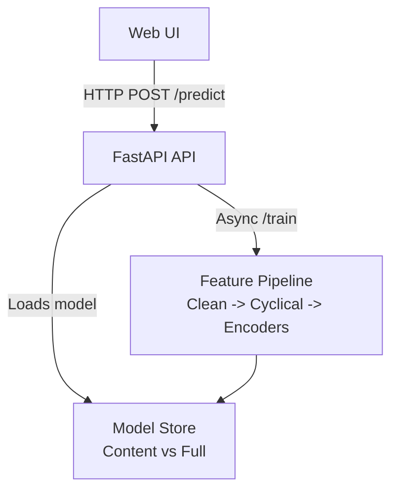

<div align="center">
  <h1>🎥 Trending Content Prediction System</h1>
  <p><strong>IT Happens @ RAALE #3 Hackathon Project</strong></p>
  <p>A production-grade machine learning system designed to predict the virality of newly uploaded content based entirely on metadata.</p>
</div>

---

## 📖 Overview
This project predicts whether content (like videos or movies) will go viral based purely on its metadata. We built a robust, decoupled architecture separating event ingestion from prediction using FastAPI, Python, SQLite, and a static Web UI for diagnostics.

Our custom dual-model feature routing strategy gracefully manages cold-start scenarios, automatically falling back to a content-only model for unseen creators or channels.

---

## 🏗 Architecture
The system employs a multi-layer design to serve predictions asynchronously and explainably.



---

## 📊 Data & Features
- **Datasets**: Synthetic YouTube Trending & TMDB Metadata (modeling real-world correlations).
- **Class Balance**: 53.77% trending, 46.23% non-trending.
- **Features Vectors** (17 total dimensions):
  - **Metadata**: `genre_encoded`, `language_encoded`, `duration_minutes`.
  - **Temporal**: Cyclical encoding for `hour`, `day_of_week`, `month`, plus `is_weekend`, `is_prime_time`.
  - **Text Metrics**: `title_length`, `title_word_count`, `title_caps_ratio`, `tag_count`.
  - **Creator Profile** (Full model only): `channel_trending_rate`, `channel_upload_count`.

---

## 🧠 Machine Learning Approach

| Design Area | Selected Strategy | Rationale |
|-------------|-------------------|-----------|
| **Target Variable** | Binary (1 = Trending, 0 = Regular) | Fits standard classification objectives; avoids regression ambiguity. |
| **Model Type** | **CatBoost** (Primary) / **Random Forest** (Fallback) | CatBoost natively handles high-cardinality categorical variables. RF provides a robust fallback without compilation issues. |
| **Imbalance** | `scale_pos_weight` & `class_weight='balanced'` | Rebalances training loss natively without introducing synthetic interpolation errors. |
| **Cold Starts** | **Dual-Model Strategy** | Separate full and content-only models prevent creator historical weights from artificially skewing predictions for new creators. |

### Model Performance
| Model | Feature Set | F1-Score | ROC-AUC | Status |
|-------|-------------|----------|---------|--------|
| **Logistic Regression** | Full features | 0.7627 | 0.8466 | Baseline |
| **CatBoost (Content)** | Content only | 0.7885 | 0.8705 | Fallback |
| **CatBoost (Full)** | Full features | 0.7822 | 0.8559 | **🏆 Champion** |

---

## 🚀 Key Features

1. **Single Page Application (SPA)**: A sleek **Voltage Neo-Brutalist** UI featuring 5 diagnostic tabs (Dashboard, Predictions, Anatomy, Models, Observability).
2. **Live Movie Explorer**: Real-time integration with TMDB/TVmaze for live trend scanning and prediction injection.
3. **Active Serving Audit Logs**: Real-time inference monitoring in the Observability tab.
4. **Model Rollback Console**: SQLite-backed version registry for hot-swapping active models.
5. **Gateway Validation**: Strict Pydantic schemas block invalid payloads (e.g., negative duration or missing features) with clean `422 Unprocessable Entity` responses.

---

## 💻 Getting Started

### Prerequisites
- Docker and Docker Compose installed.

### Run the System
1. **Bring up the stack**:
   ```bash
   docker compose up --build
   ```
2. **Access the Web UI**:
   Navigate to [http://localhost:3000](http://localhost:3000)
3. **Check API Health**:
   ```bash
   curl http://localhost:8000/health
   ```

### Run Tests Locally
To run the test suite within a python virtual environment:
```bash
python -m venv .venv
source .venv/bin/activate
pip install -r requirements.txt
PYTHONPATH=. pytest -v
```

---

## 🔮 Future Enhancements
- **Automated Retraining**: Implement automated triggers when concept drift exceeds 0.20 via Kolmogorov-Smirnov tests.
- **Cold-Start Bridge**: Incorporate early engagement signals (first 60-minute CTR) for new creators.
- **Regional Localization**: Split serving logic by region codes to accommodate geographic virality differences.

---
<p align="center">Built for IT Happens @ RAALE #3</p>
