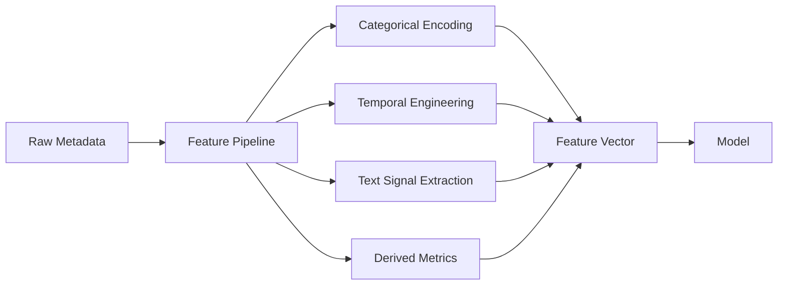
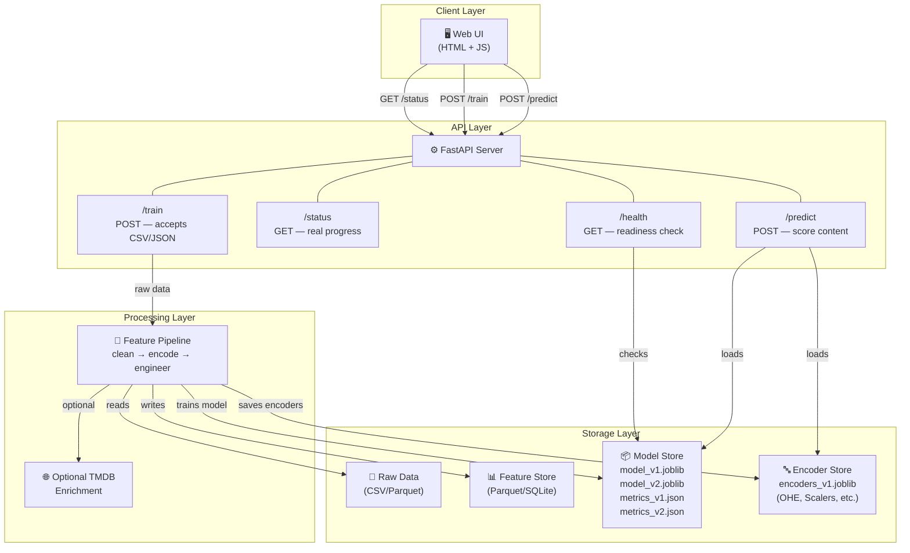
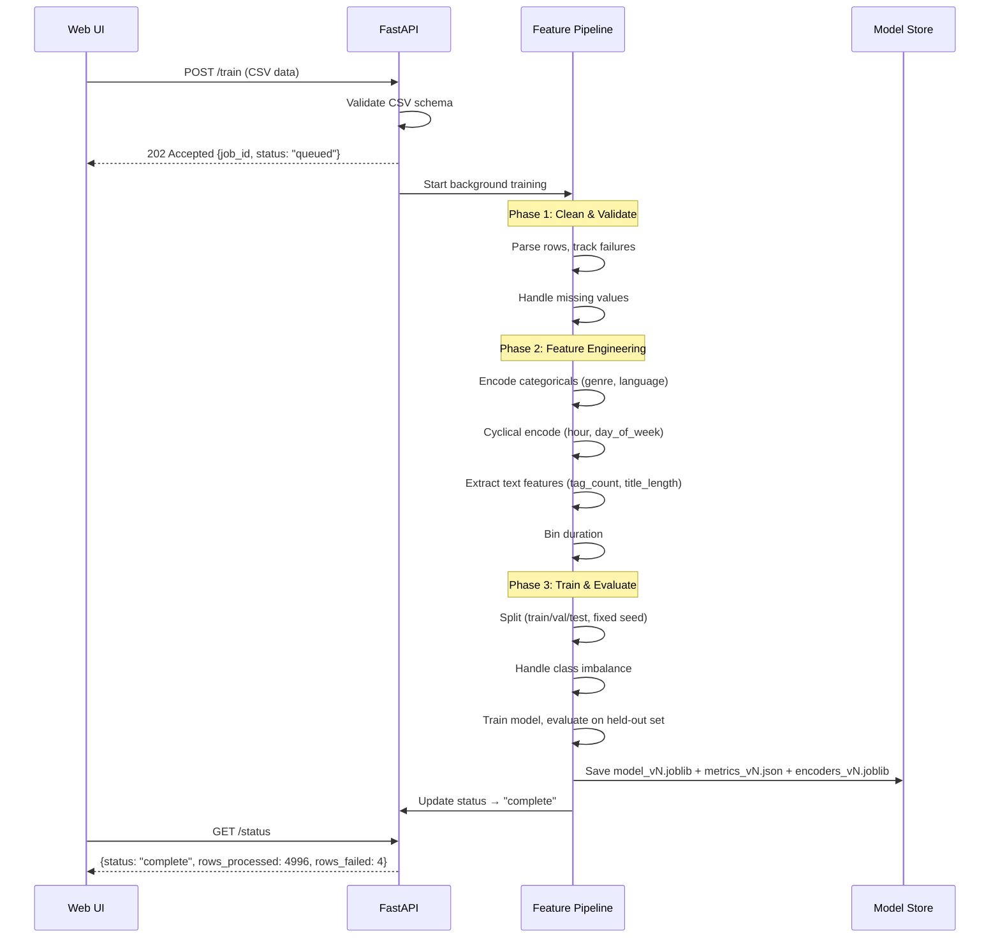
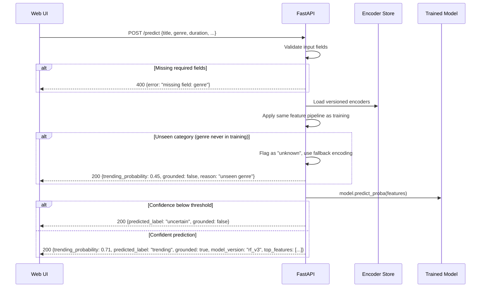

# 🏭 Industry-Level Analysis & System Design — Trending Content Prediction

## Part A: How The Real World Does This

### How YouTube Decides "Trending"

YouTube's trending algorithm is NOT purely view-count based. It considers:

| Signal | Weight | Why |
|--------|--------|-----|
| **View velocity** (views per hour) | High | Rapid growth = genuine interest, not slow accumulation |
| **Where views come from** | Medium | Organic search/browse vs shared links vs embedded |
| **Age of the video** | Medium | Newer content gets priority (recency bias) |
| **Geographic diversity** | Medium | Broad appeal across regions → trending |
| **Like/comment ratio** | Low-Medium | Engagement quality, not just quantity |
| **Category context** | Low | What's normal for "Gaming" vs "News" differs massively |

> [!NOTE]
> YouTube does NOT simply rank by views. A video with 10M views over 6 months won't trend. A video with 500K views in 2 hours might. **Velocity matters more than magnitude.**

### How Netflix Solves Cold Start (Closest to Our Problem)

Netflix faces the EXACT problem we have: **predict popularity of NEW content with zero engagement data.**

Their approach:
1. **Metadata embeddings** — encode genre, language, runtime, cast into vector representations
2. **Content-based similarity** — map new content to similar existing content that DID trend
3. **Temporal patterns** — release timing, day-of-week, seasonal trends
4. **Hybrid models** — combine metadata predictions with early engagement signals once available

> [!IMPORTANT]
> **Our hackathon constraint is harder than Netflix's** — we have metadata ONLY, no engagement data at inference time. This is the pure cold-start scenario. Our features must be entirely metadata-derived.

---

## Part B: Existing Model Approaches — What Works and What Doesn't

### Model Comparison (Industry Benchmarks for Trending/Virality Prediction)

```
┌─────────────────────┬───────────┬──────────┬──────────┬──────────────────────────┐
│ Model               │ Precision │ Recall   │ F1-Score │ Notes                    │
├─────────────────────┼───────────┼──────────┼──────────┼──────────────────────────┤
│ Logistic Regression │ 0.62-0.70 │ 0.55-0.65│ 0.58-0.67│ Fast, interpretable,     │
│                     │           │          │          │ great baseline           │
├─────────────────────┼───────────┼──────────┼──────────┼──────────────────────────┤
│ Random Forest       │ 0.72-0.80 │ 0.68-0.76│ 0.70-0.78│ Robust, handles noise,   │
│                     │           │          │          │ less tuning needed       │
├─────────────────────┼───────────┼──────────┼──────────┼──────────────────────────┤
│ XGBoost             │ 0.76-0.85 │ 0.72-0.82│ 0.74-0.83│ Best performance, needs  │
│                     │           │          │          │ more tuning              │
├─────────────────────┼───────────┼──────────┼──────────┼──────────────────────────┤
│ SVM (RBF kernel)    │ 0.68-0.75 │ 0.60-0.70│ 0.64-0.72│ Good but slow on large   │
│                     │           │          │          │ datasets                 │
├─────────────────────┼───────────┼──────────┼──────────┼──────────────────────────┤
│ Neural Net (MLP)    │ 0.70-0.78 │ 0.65-0.75│ 0.67-0.76│ Overkill for tabular,    │
│                     │           │          │          │ harder to debug          │
└─────────────────────┴───────────┴──────────┴──────────┴──────────────────────────┘
```

> **Verdict**: For this hackathon, the sweet spot is **Logistic Regression as baseline → Random Forest as primary → XGBoost if time permits**. Neural nets are overkill for structured tabular data and waste precious hackathon time.

### Why Each Model Works (or Doesn't)

#### ✅ Logistic Regression — The Honest Baseline
```
Pros: Fast to train, fully interpretable coefficients, easy to explain in report
Cons: Cannot capture non-linear genre × upload_time interactions
Use:  ALWAYS train this FIRST as your baseline benchmark
```

#### ✅ Random Forest — The Production Workhorse
```
Pros: Handles mixed types, feature importance built-in, robust to noise
Cons: Slightly slower inference, can overfit small datasets
Use:  Primary model — best risk/reward for hackathon time
```

#### ✅ XGBoost — The Performance King
```
Pros: Best metrics, handles imbalance with scale_pos_weight, regularization
Cons: More hyperparameters to tune, risk of spending too long tuning
Use:  Only if Random Forest is working AND you have 30+ minutes left
```

---

## Part C: Feature Engineering Playbook

### Raw Input → Engineered Features



### Feature Engineering Table — What to Extract from Each Raw Field

| Raw Field | Engineered Features | Encoding Method | Why It's Predictive |
|-----------|-------------------|-----------------|-------------------|
| **genre** | `genre_encoded`, `genre_trending_rate` | One-hot or Target Encoding | Some genres trend 5× more than others |
| **duration_minutes** | `duration_bin` (short/medium/long), `log_duration` | Binning + Log transform | Sweet spots exist (8-15 min for YouTube, 90-120 min for movies) |
| **upload_time** | `hour_sin`, `hour_cos`, `day_of_week_sin`, `day_of_week_cos`, `is_weekend`, `is_prime_time` | **Cyclical Encoding** (sine/cosine) | 6PM upload trends more than 3AM; cyclical encoding preserves the distance between 11PM and 1AM |
| **language** | `language_encoded`, `is_english`, `language_trending_rate` | Target Encoding | English content has broader reach; some languages trend regionally |
| **tags** | `tag_count`, `has_popular_tag`, `tfidf_top_features` | Count + TF-IDF | Tag density and specific tags correlate with trending |
| **title** | `title_length`, `title_word_count`, `has_numbers`, `has_question` | Length + pattern detection | Clickbait patterns, optimal title lengths |

### Cyclical Time Encoding (Critical — Most Students Get This Wrong)

Why you can't just use `hour=23` as a raw number:
```
Distance between hour 23 and hour 1 = |23-1| = 22  ← WRONG (it's actually 2 hours)
```

**Correct approach — Sine/Cosine transformation:**
```python
import numpy as np

def cyclical_encode(value, max_value):
    """Encode cyclical features using sin/cos transformation."""
    sin_val = np.sin(2 * np.pi * value / max_value)
    cos_val = np.cos(2 * np.pi * value / max_value)
    return sin_val, cos_val

# Hour: 0-23 → sin/cos pair
hour_sin, hour_cos = cyclical_encode(hour, 24)

# Day of week: 0-6 → sin/cos pair
dow_sin, dow_cos = cyclical_encode(day_of_week, 7)

# Month: 1-12 → sin/cos pair
month_sin, month_cos = cyclical_encode(month, 12)
```

Now hour 23 and hour 1 are CLOSE in the encoding space ✅

### Class Imbalance Strategy (This Is Where Most Teams Fail)

**The Problem:** Trending content is ~5-15% of all content. A model that always predicts "not trending" gets 85-95% accuracy but is completely useless.

**3-Tier Strategy:**

| Tier | Method | When to Use | Code |
|------|--------|-------------|------|
| 1 (Default) | `class_weight='balanced'` | Always — zero cost | `RandomForestClassifier(class_weight='balanced')` |
| 2 (If Tier 1 insufficient) | SMOTE | If recall < 0.5 | `from imblearn.over_sampling import SMOTE` |
| 3 (Advanced) | SMOTE-Tomek | If boundary is noisy | `from imblearn.combine import SMOTETomek` |

> [!WARNING]
> **SMOTE must ONLY be applied to training data, NEVER to validation/test sets.** Use `imblearn.pipeline.Pipeline` to ensure this automatically during cross-validation.

```python
# Correct way to handle imbalance
from imblearn.pipeline import Pipeline as ImbPipeline
from imblearn.over_sampling import SMOTE

pipeline = ImbPipeline([
    ('smote', SMOTE(random_state=42)),
    ('classifier', RandomForestClassifier(random_state=42))
])
# SMOTE only touches training folds during cross-validation ✅
```

---

## Part D: Production System Design

### System Architecture (What We're Building)



### Data Flow — Training Pipeline



### Data Flow — Prediction Pipeline



### Model Versioning Strategy

```
model-store/
├── model_v1.joblib          # Logistic Regression baseline
├── metrics_v1.json          # {"accuracy": 0.78, "f1": 0.62, "precision": 0.65, "recall": 0.59}
├── encoders_v1.joblib       # Fitted OHE, scalers, etc.
├── model_v2.joblib          # Random Forest
├── metrics_v2.json          # {"accuracy": 0.84, "f1": 0.74, "precision": 0.77, "recall": 0.71}
├── encoders_v2.joblib
├── active_model.txt         # "v2" — pointer to which model /predict uses
└── training_config_v2.json  # {"seed": 42, "split": [0.7, 0.15, 0.15], "features": [...]}
```

> [!TIP]
> Never overwrite a model file. Always increment version. If v3 trains badly, just point `active_model.txt` back to v2 — instant rollback without retraining.

---

## Part E: Evaluation Framework

### Metrics We Must Report (and Why)

| Metric | What It Tells Us | Why Accuracy Alone Fails |
|--------|-----------------|------------------------|
| **Precision** | "Of items we called trending, how many actually were?" | High precision = less wasted promotion budget |
| **Recall** | "Of all trending items, how many did we catch?" | High recall = fewer missed opportunities |
| **F1-Score** | Harmonic mean of precision & recall | Balances both concerns |
| **ROC-AUC** | Overall discrimination ability | Works regardless of threshold choice |
| **PR-AUC** | Precision-Recall curve area | Better than ROC-AUC for imbalanced data |
| **Confusion Matrix** | True/False Positives/Negatives | Shows WHERE the model fails |

### Confidence Threshold Logic

```python
def make_prediction(model, features, threshold=0.6):
    """Predict with honesty — never fabricate confidence."""
    proba = model.predict_proba(features)[0]
    trending_prob = proba[1]  # probability of "trending" class
    
    if trending_prob >= threshold:
        return {"predicted_label": "trending", "grounded": True, "trending_probability": round(trending_prob, 3)}
    elif trending_prob <= (1 - threshold):
        return {"predicted_label": "not_trending", "grounded": True, "trending_probability": round(trending_prob, 3)}
    else:
        return {"predicted_label": "uncertain", "grounded": False, "trending_probability": round(trending_prob, 3),
                "reason": "Model confidence below threshold — prediction may not be reliable"}
```

---

## Part F: Our 3-Tier Model Strategy

### Tier 1: Logistic Regression (Baseline — Build FIRST)
- **Features**: genre (one-hot), duration_bin, hour_sin/cos, is_weekend, language (one-hot), tag_count
- **Expected F1**: ~0.60-0.67
- **Time to build**: 15-20 minutes
- **Purpose**: Establishes the floor. Everything else must beat this.

### Tier 2: Random Forest (Primary — Replace Tier 1 once working)
- **Features**: Same as Tier 1 + title_length, has_popular_tag, genre_trending_rate
- **Expected F1**: ~0.70-0.78
- **Time to build**: 10-15 minutes (swap classifier, retune)
- **Purpose**: Main production model. Probably what ships.

### Tier 3: XGBoost (Stretch — Only if pipeline is solid)
- **Features**: Same as Tier 2 + TF-IDF on tags/title (top 50 terms)
- **Expected F1**: ~0.74-0.83
- **Time to build**: 15-20 minutes (hyperparameter tuning needed)
- **Purpose**: Competition edge. Only attempt if Tier 2 pipeline is working perfectly.

---

## Part G: Key Design Decisions (Pre-Decided)

| Decision | Chosen | Rejected | Reason |
|----------|--------|----------|--------|
| **Trending label definition** | Appeared on trending list (binary) | View count threshold | Binary label from dataset is cleaner than arbitrary threshold |
| **Primary model** | Random Forest | XGBoost, Neural Net | Best risk/reward — less tuning, robust, good feature importance |
| **Class imbalance** | `class_weight='balanced'` + SMOTE if needed | Undersampling, cost-sensitive learning | Balanced weights are free; SMOTE is proven for this domain |
| **Feature encoding** | One-hot for genre, cyclical for time, TF-IDF for text | Label encoding, raw timestamps | Cyclical encoding is mathematically correct for time; one-hot preserves independence |
| **Model readiness** | `/health` checks model file exists + metrics above minimum F1 threshold | Container started = ready | Prevents serving a broken or untrained model |
| **Unseen categories** | Fallback to "unknown" bucket + `grounded: false` | Crash / error | Graceful degradation, honest about uncertainty |
| **Feature store** | Local Parquet files | SQLite, Redis | Fastest boot time, simplest debugging, meets hackathon scale |
| **API framework** | FastAPI | Flask | Async support for enrichment calls, auto-docs, Pydantic validation |

---

## Part H: File/Folder Structure

```
trending-content-prediction/
├── docker-compose.yml              # One command to rule them all
├── .env                            # TMDB_API_KEY (never in source)
├── README.md
├── REPORT.md                       # The 30-mark report
│
├── ui/
│   ├── Dockerfile
│   ├── index.html                  # Submit form + prediction display
│   ├── styles.css
│   └── app.js                      # fetch() calls to API
│
├── api/
│   ├── Dockerfile
│   ├── requirements.txt            # ALL versions pinned
│   ├── main.py                     # FastAPI app — /train, /status, /predict, /health
│   ├── schemas.py                  # Pydantic request/response models
│   └── config.py                   # Settings, paths, thresholds
│
├── pipeline/
│   ├── __init__.py
│   ├── feature_engineering.py      # Raw → engineered features
│   ├── training.py                 # Train + evaluate + save versioned model
│   ├── encoders.py                 # Fit/save/load encoders (OHE, scalers)
│   └── predict.py                  # Load model + encoders → score
│
├── model-store/                    # Versioned artifacts
│   ├── model_v1.joblib
│   ├── metrics_v1.json
│   ├── encoders_v1.joblib
│   └── active_model.txt
│
├── data/                           # Raw datasets (NEVER mutated)
│   └── youtube_trending.csv
│
└── tests/
    ├── test_hostile_inputs.py      # Empty CSV, missing fields, unseen genre
    └── test_reproducibility.py     # Two runs → same metrics
```

---

## Next Step

> [!IMPORTANT]
> **Approve this design, and I'll start building — pipe first, model second, exactly as the problem statement demands.** I'll follow the skeleton-first strategy: fake logic end-to-end → replace with real logic one component at a time.
